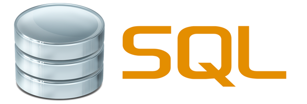
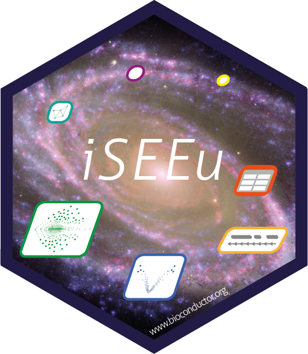

layout: true

<div class="my-header"></div>

<div class="my-footer"><span>
Kevin Rue-Albrecht
&emsp;&emsp;&emsp;&emsp;&emsp;&emsp;&emsp;&emsp;&emsp;&emsp;&emsp;&emsp;
SSI Fellowship Application 2021
</span></div>

```{r setup, include=FALSE}
stopifnot(require(htmltools))
stopifnot(require(RefManageR))
stopifnot(require(knitr))
stopifnot(require(leaflet))
stopifnot(require(maps))
stopifnot(require(tidyverse))
data("world.cities")
```

```{r knitr, include=FALSE}
knitr::opts_chunk$set(
  echo = FALSE
)
```

```{r htmltools, include=FALSE}
stopifnot(requireNamespace("htmltools"))
htmltools::tagList(rmarkdown::html_dependency_font_awesome())
options(htmltools.preserve.raw = FALSE)
```

```{r, load_refs, include=FALSE, cache=FALSE}
options(htmltools.dir.version = FALSE)
BibOptions(
  check.entries = FALSE,
  bib.style = "authoryear",
  cite.style = "authoryear",
  max.names = 3,
  style = "markdown",
  hyperlink = "to.doc",
  dashed = TRUE)
bib <- ReadBib("references.bib")
```

---

# About me

```{r, fig.align='center'}
knitr::include_graphics("img/ox_brand1_pos_rect.gif")
```

.center[
.xx-large-p[
Computational Biologist
]

<i class="fas fa-dna fa-7x"></i>&emsp;&emsp;&emsp;
<i class="far fa-file-code fa-7x"></i>&emsp;&emsp;&emsp;
<i class="fas fa-chart-bar fa-7x"></i>
]

---

# 2021 Fellowship Program

```{r, fig.align='center'}
knitr::include_graphics("img/ssi_logo_with_name-large.jpg")
```

---

# More about me

```{r, fig.width=8, fig.height=6.5, fig.width=10, results='asis', warning=FALSE, fig.align='center'}
strasbourg <- world.cities %>% 
  filter(name == "Strasbourg" & country.etc == "France") %>% 
  mutate(info = "Where I'm from")
nice <- world.cities %>% 
  filter(name == "Nice" & country.etc == "France") %>% 
  mutate(info = "Where I received<br/>my Diplôme d'Ingénieur (M.Sc.)")
dublin <- world.cities %>% 
  filter(name == "Dublin" & country.etc == "Ireland") %>% 
  mutate(info = "Where I received<br/>my Ph.D.")
oxford <- world.cities %>% 
  filter(name == "Oxford" & country.etc == "UK") %>% 
  mutate(info = "Where I work now")
markers <- bind_rows(
  strasbourg,
  nice,
  dublin,
  oxford
) %>% mutate(
  label = sprintf("<b>%s (%s)</b><br/>%s", name, country.etc, info)
)
leaflet(options = leafletOptions(minZoom = 2, maxZoom = 5)) %>%
  addProviderTiles("Stamen.Watercolor") %>% 
  addMarkers(~long, ~lat, data = markers) %>% 
  addLabelOnlyMarkers(~long, ~lat, label = ~as.character(label), data = markers,
    labelOptions = labelOptions(noHide = TRUE, direction = 'left', textOnly = TRUE, textsize = "16px"))
```

.right[
Using `r BiocStyle::CRANpkg("leaflet")`
]

---

# A bird's-eye view of my programming journey

</img>
<!-- Source: https://logos-world.net/matlab-logo/ -->
&emsp;
</img>
<!-- Source: https://commons.wikimedia.org/wiki/File:JavaScript-logo.png -->
&emsp;
</img>
<!-- Source: https://www.r-project.org/logo/ -->
&emsp;
</img>
<!-- Source: https://commons.wikimedia.org/wiki/File:JavaScript-logo.png -->
&emsp;
</img>
<!-- Source: https://blog.stoneriverelearning.com/6-reasons-why-you-should-learn-sql/ -->
&emsp;
</img>
<!-- Source: http://www.unix.org/u30logo.html -->
&emsp;
</img>
<!-- Source: https://www.subpng.com/png-3h4o8r/ -->

.pull-left[

```
>> fprintf 'Hello, Matlab!'
```

```
>>> print("Hello, Python!")
```

```
> cat("Hello, R!")
```

```
<script>
  alert( 'Hello, JavaScript!' );
</script>
```

]

.pull-right[
```
SELECT COUNT(*) FROM hellosql;
```

```
echo "Hello, Unix!"
```

```
<html>
  <body>
    <p>Hello, HTML!</p>
  </body>
</html>
```
]

---

# GOexpress

.center[
</img>
<!-- Source: https://github.com/Bioconductor/BiocStickers/tree/master/Bioconductor -->
</img>
<!-- Source: https://github.com/Bioconductor/BiocStickers/tree/master/GOexpress -->

<https://bioconductor.org/packages/iSEE>
]

---

# Ph.D. Research

.center[
</img>
]

.right[
<https://doi.org/10.3389/fimmu.2014.00536>
]

---

# Continuing contributions to the Bioconductor project

.center[
<https://bioconductor.org>

</img>
<!-- Source: https://github.com/Bioconductor/BiocStickers/tree/master/Bioconductor -->
</img>
<!-- Source: https://github.com/Bioconductor/BiocStickers/tree/master/TVTB -->
</img>
<!-- Source: https://github.com/Bioconductor/BiocStickers/tree/master/iSEE -->
</img>
<!-- Source: https://github.com/Bioconductor/BiocStickers/tree/master/iSEEu -->

<https://bioconductor.org/packages/TVTB> (2016)

<https://bioconductor.org/packages/iSEE> (2018)

<https://bioconductor.org/packages/iSEEu> (2020)
]

---

# iSEE

.center[
</img>
]

---

# Most technically impressive app

.center[
</img>
<!-- Source: https://github.com/Bioconductor/BiocStickers/tree/master/iSEE -->
</img>
]

.right[
<https://blog.rstudio.com/2019/04/05/first-shiny-contest-winners>
]

---

# GitHub organisation

.center[
</img>
]

.right[
<https://github.com/iSEE>
]

---

# OBDS Training Programme

.center[
</img>
]

.pull-left[
## Instructor

- Unix and HPC environments

- Conda

- Git and GitHub

- Python

- R and Bioconductor
]

.pull-right[
<br/>

</img>

.right[
[www.imm.ox.ac.uk](https://www.imm.ox.ac.uk/research/units-and-centres/mrc-wimm-centre-for-computational-biology/training/oxford-biomedical-data-science-training-programme)
]
]

---

# Co-organiser & Contributor

.center[
</img>
]

.center[
</img>
]

---

# My fellowship plan

.center[
<i class="fas fa-user-graduate fa-7x"></i></i>&emsp;&emsp;&emsp;

<i class="fab fa-osi fa-7x"></i>&emsp;&emsp;&emsp;

<i class="far fa-handshake fa-7x"></i>
]

<!-- Don't forget BiocChallenges -->

---

# 1. Local & Online events

.x-large-li[
- Thematic workshops

- Software Carpentry

- DevOps (CI/CD, unit testing, GitHub Actions, containerisation)

- Blog posts and videos

  + <i class="fab fa-github"></i> <https://kevinrue.github.io>
  
  + <i class="fab fa-youtube"></i> [iSEE playlist](https://www.youtube.com/playlist?list=PLOsChEX1ArWEwkPUTeQK9fhNB96LQJm5H)
]

---

# 2. Expanding the iSEE universe

.x-large-li[
- New panels to support more data types

  + e.g., <i class="fab fa-github"></i> <https://github.com/jgilis/iSEEtranscripts>

- Online workshops

  + e.g. <i class="fab fa-github"></i> <https://isee.github.io/iSEEWorkshopEuroBioc2020>

- iSEE book

  + <https://isee.github.io/iSEE-book>

- Deployment, accessibility, scalability
]

---

# 3. Collaboration

.x-large-li[
- BiocChallenges </img>

  + <https://kevinrue.github.io/BiocChallenges>
]

---

# Fellowship: 3 goals

.xx-large-p[
<i class="fas fa-user-graduate fa-4x" aling="middle"></i></i>
&emsp;&emsp;
Local & Online Educational Events

<i class="fab fa-osi fa-4x"></i>
&emsp;&emsp;
Expand the iSEE universe

<i class="far fa-handshake fa-4x"></i>
&emsp;
Collaborate on open-source challenges
]

---

# Software Sustainability Institute

.center[
</img>
]
